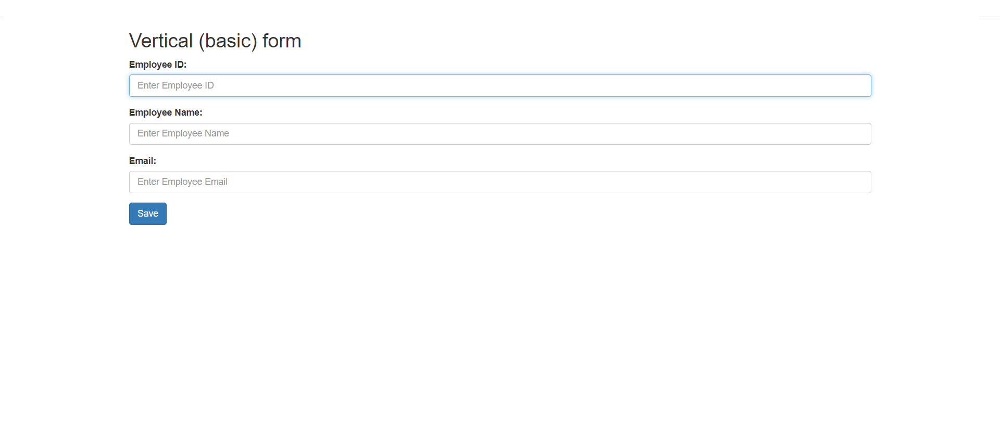

# CRUD API JSONPowerDB
## Description
CRUD API JSONPowerDB is a High Performance, Light Weight, Ajax Enabled, Serverless, Simple to Use, Real-time Database. Easy and fast to develop database applications without using any server side programming / scripting or without installing any kind of database.

## Benefits of using JsonPowerDB
Simplest way to retrieve data in a JSON format.
Schema-free, Simple to use, Nimble and In-Memory database.
It is built on top of one of the fastest and real-time data indexing engine - PowerIndeX.
It is low level (raw) form of data and is also human readable.
It helps developers in faster coding, in-turn reduces development cost.

### Screenshot

## Release History
Work in progress

## Requirements
Web Browser
Database Connection Token

# Scope of functionalities
It is a very basic project for demonstration of JsonPowerDb with help of a web application for Employee management
